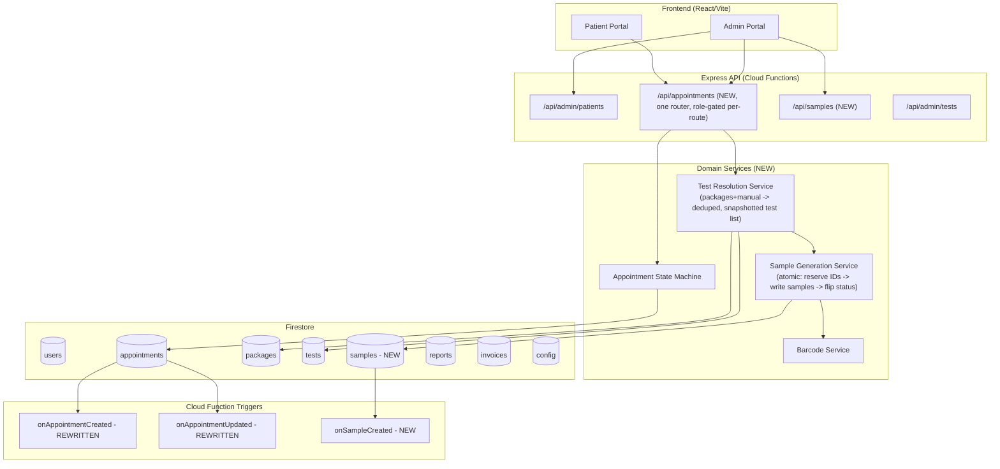
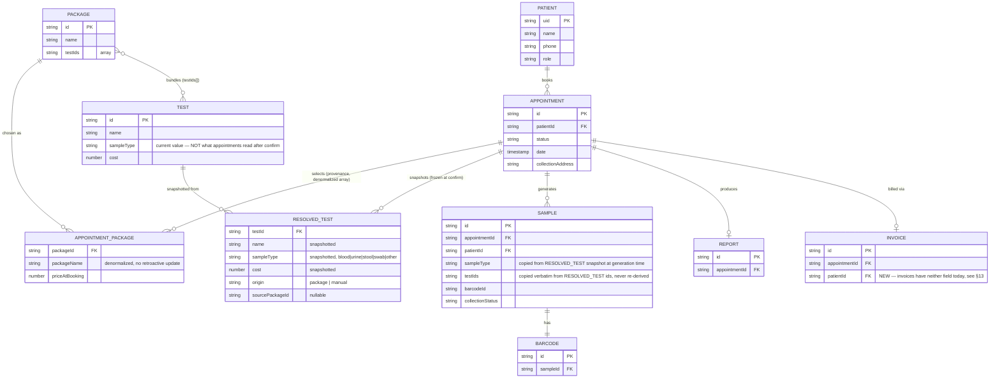
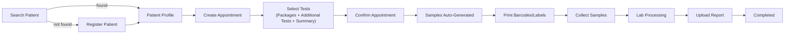
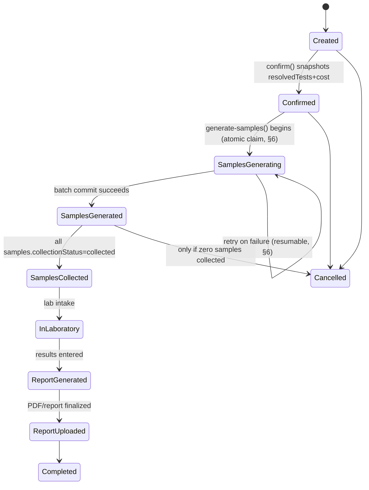

# LIMS Architecture Refactor — Technical Design Document (v2)

**Status:** Proposed — revised after independent architecture review + repo-convention audit
**Scope:** Patient → Appointment → Tests → Samples → Barcode → Reports
**Branch context:** `feature/refactor_admin_patient_flow`
**Stack:** React + Vite (frontend), Express on Firebase Cloud Functions (backend), Firestore (DB), Firebase Auth, Cloud Storage

**Changelog from v1:** v1 was reviewed by an independent architecture pass and a repo-convention audit. Both surfaced issues serious enough to fix before implementation: sample generation wasn't atomic (a partial failure could leave real barcodes printed on orphaned tubes), the migration's counter document would self-throttle against a real appointment history, a Cloud Function trigger would silently stop sending emails the moment the new status enum shipped, and several "reuse X" claims (TestPicker, invoiceCounter pattern) didn't match what actually exists in the codebase. Every §-reference below reflects the corrected design; superseded v1 content is not repeated.

## Core Principle

> Packages are a convenience for selecting tests. They are never the source of truth downstream of appointment creation.

Everything after test selection — sample derivation, barcode generation, collection, lab processing, reporting — operates on **Tests** and **Samples** only. The system must never branch its logic on "was this from a package or manual selection." A package's only job is to expand into a set of test IDs at selection time; after that, it is provenance metadata, not a control-flow input.

**v2 correction:** v1 froze *which* tests apply (`resolvedTestIds`) at confirm time but left each test's *attributes* — `sampleType`, `cost` — as live lookups against the `tests` collection at `generate-samples` time. That's the same "silently changes meaning" bug the doc opens by criticizing, just moved one level down: if an admin edits a test's `sampleType` between confirm and generate-samples, sample grouping for a "frozen" appointment changes based on present-day data instead of what was true at booking. **Fix:** freeze a snapshot per test, not just the ID, at confirm time (see §2, §4).

---

## 1. High-Level System Architecture



★ Insight ─────────────────────────────────────
Firestore is a document database, not relational — there is no `JOIN`, no foreign-key constraint enforcement, and no schema migration tool. Every "relationship" here is enforced entirely in application code. That's also why atomicity has to be designed explicitly rather than assumed: a SQL refactor of this shape could lean on a single multi-table transaction; here, "create N sample docs + update 1 appointment doc + advance a counter" is several independent writes unless you deliberately fit them inside Firestore's transaction/batch primitives (§6).
─────────────────────────────────────────────────

---

## 2. Updated Domain Model

```
Patient (users)
  └─ Appointment
       ├─ packages[]           (denormalized snapshot: which packages, price at booking — provenance only)
       ├─ resolvedTests[]      (SNAPSHOTTED at confirm time: {testId, name, sampleType, cost, origin} — the real payload)
       └─ Sample[]             (derived from resolvedTests, grouped by the SNAPSHOTTED sampleType)
              ├─ Barcode (1:1, generated at sample creation)
              └─ testIds[]     (which resolvedTests entries this sample satisfies, copied verbatim, never re-derived)
Report (1 per Appointment, produced once all Samples are processed)
Invoice (linked to Appointment via appointmentId — see §13 for the gap this closes)
```

**v2 correction:** `resolvedTests` is now an array of snapshot objects, not a bare `string[]` of IDs. This is the fix for the test-attribute-freezing gap: `{testId, name, sampleType, cost, origin, sourcePackageId}` is captured once, at `confirm()`, from whatever `tests/{testId}` looks like *at that moment*. `generate-samples` and any later re-read of the appointment groups by the snapshotted `sampleType`, never by a live lookup. If the underlying test is edited or even deleted afterward, the frozen appointment is unaffected — exactly the guarantee the core principle promises.

Packages still do **not** get their own sample-mapping table — `deriveSamples` groups the snapshot array by its own `sampleType` field, so there is still exactly one place sample-type information is authored (the `tests` collection, captured into the snapshot at confirm time), never two.

---

## 3. ER Diagram



`RESOLVED_TEST.origin` is the only place package-vs-manual provenance is recorded, purely for display and billing reconciliation. No sample generation, collection, lab, or reporting logic reads it.

---

## 4. Firestore Schema Changes

### `tests` (MODIFIED)
```ts
{
  id: string
  testId: string
  name: string
  parameters: TestParameter[]
  cost?: number
  sampleType: SampleType        // NEW, required for new tests; backfilled to 'other' for existing rows
  createdAt: Timestamp
  updatedAt: Timestamp
}
type SampleType = 'blood' | 'urine' | 'stool' | 'swab' | 'other'
```

### `appointments` (MODIFIED — additive, old fields kept read-only for back-compat)
```ts
{
  id: string
  patientId: string
  patientName: string
  patientPhone: string

  // LEGACY — kept permanently, read-only, never written by new code paths
  packageId?: string            // was required; now optional — every new-model appointment omits it
  packageName?: string
  packagePrice?: number
  barcodeId?: string

  // NEW
  packages: Array<{ packageId: string; packageName: string; priceAtBooking: number }>
                                     // denormalized; packageName/priceAtBooking do NOT update retroactively
                                     // if the source package is later renamed/repriced — intentional, mirrors
                                     // how packagePrice already worked in the legacy model
  manualTestIds: string[]           // tests added outside any package, pre-confirm working state
  resolvedTests: Array<{            // FROZEN at confirm() — see §2 correction. Empty array pre-confirm.
    testId: string
    name: string
    sampleType: SampleType
    cost: number
    origin: 'package' | 'manual'
    sourcePackageId?: string
  }>
  sampleIds: string[]                // denormalized pointer list; source of truth is `samples` collection
  totalCost: number                  // sum of resolvedTests[].cost, computed once at confirm()

  date: string
  timeSlot: string
  collectionAddress: string
  status: AppointmentStatus          // NEW enum — see §8. Written from day 1 of Phase 1 (see §15, this is NOT
                                      // deferred to Phase 3 — the trigger rewrite ships in the same deploy)
  legacyStatus?: string              // old status string, preserved for audit only
  invoiceId?: string                 // NEW — see §13 for why this doesn't fully close the invoice gap alone
  notes?: string
  createdAt: Timestamp
  updatedAt: Timestamp
}
```

### `samples` (NEW top-level collection)
```ts
{
  id: string                 // "S-2026-000001" — see §10
  appointmentId: string
  patientId: string
  sampleType: SampleType     // copied from the resolvedTests snapshot at generation time
  testIds: string[]          // copied verbatim from resolvedTests[].testId, never re-derived post-generation
  barcodeId: string          // 1:1, generated with the sample
  collectionStatus: 'pending' | 'collected' | 'rejected'
  collectionDatetime?: Timestamp
  collector?: string
  remarks?: string
  createdAt: Timestamp
  updatedAt: Timestamp
}
```

Kept as a top-level collection (not an `appointments` subcollection) because lab staff need cross-patient queries like "all uncollected blood samples today" — a collection-level query, not something a subcollection structure serves well.

### `packages` — unchanged structurally.

### `invoices` (MODIFIED — bigger gap than v1 stated)
Current `Invoice` has **neither** `appointmentId` nor `patientId` — it's keyed on free-text `billToName`/`billToContact` only, entirely disconnected from the patient/appointment graph, and is created client-side with no Express route at all.
```ts
{
  ...existing fields (billToName, billToContact, lineItems, receivedAmount, ...)...
  appointmentId?: string     // NEW
  patientId?: string         // NEW — didn't exist before; required to actually link an invoice to a patient record
}
```
This refactor adds the fields and a minimal `POST /api/admin/invoices` route so linkage is validated server-side (see §13); it does not attempt to redesign invoicing/billing logic beyond that.

### `config` (ADDITIVE)
```ts
config/sampleCounter: { year: number, seq: number }
```
**v2 correction:** v1 called this "the same pattern as `invoiceCounter`." It is not — `invoiceCounter` (`src/lib/firestore.ts:246-254`) is `{lastNumber: number}` with no year component, and is transacted from the **browser** via the client SDK, protected only by `firestore.rules`. `sampleCounter` is a deliberate improvement, not a reuse: server-side only (Admin SDK, inside Express), year-scoped, and — critically — never hit with one transaction per sample during migration (see §13's counter-contention fix). Treat these as two independent implementations that happen to share the "Firestore counter document" idea, not shared code.

### Security rules (NEW — missing entirely from v1)
`firestore.rules` currently has no entry for `samples`, and the existing `appointments` `create` rule (`request.resource.data.patientId == request.auth.uid`) has no admin branch — which is *why* walk-in creation is impossible today via the client SDK. Since all new writes go through Express + the Admin SDK (which bypasses rules, same as `adminPatients.ts` does today), add rules now as defense-in-depth and to make intent explicit, not because the API depends on them:
```
match /samples/{sampleId} {
  allow read: if isAdmin() || request.auth.uid == resource.data.patientId;
  allow write: if isAdmin();   // in practice: server-only via Admin SDK
}
```
modeled directly on the existing `reports` rule (`firestore.rules:25-28`), since samples are patient-visible-read-only data from the client's perspective, same as reports.

**Decision required for Phase 3 (§13):** once the old client-side `createAppointment()` path is removed, tighten `appointments`' `create` rule to `isAdmin()`-only (server writes bypass rules anyway) so the now-unused patient-self-create path isn't left open with none of the new validation applied to it.

### Composite indexes (NEW — missing entirely from v1)
The repo has no `firestore.indexes.json` today. This refactor requires at least:
- `samples`: composite index on `(sampleType, collectionStatus, createdAt)` — for the "uncollected blood samples today" lab dashboard query.
- `samples`: index on `(appointmentId)` — for `GET /appointments/:id/samples`.
- `appointments`: index on `(status, date)` — for the admin appointments list once it filters/sorts server-side instead of the current full-collection client read.

These must be committed to `firestore.indexes.json` and deployed (`firebase deploy --only firestore:indexes`) *before* the corresponding query ships, or it fails at runtime with a missing-index error on first use — there's no CI check today that would catch this, so it needs to be an explicit manual step in the rollout checklist (§13).

---

## 5. Backend API Design

**v2 correction (routing):** this repo mounts one router per admin resource (`/api/admin/patients`, `/api/admin/tests`) via `api/src/app.ts`, with `verifyAuth` + `requireAdmin` middleware. There is no precedent for a non-admin-namespaced route, and v1's plan for one shared `/api/appointments` path used by both portals needs a concrete auth strategy, not two implicit actors. **Design:** one router mounted at `/api/appointments`, `verifyAuth` applied to every route, `requireAdmin` applied conditionally inside each handler — a patient may act only on `patientId === req.user.uid`; an admin may act on any patient. This is a single code path per the "no separate business logic for admin vs patient" principle, with authorization as the only branch.

```
# Patients (existing, unchanged)
POST   /api/admin/patients
PATCH  /api/admin/patients/:uid

# Appointments (NEW — one router, verifyAuth always, requireAdmin conditionally per handler)
POST   /api/appointments                       { patientId, packageIds[], manualTestIds[], date, timeSlot, collectionAddress, notes? }
GET    /api/appointments/:id
PATCH  /api/appointments/:id                    { date?, timeSlot?, collectionAddress?, notes? }   -- only pre-confirm
POST   /api/appointments/:id/confirm            -- Created -> Confirmed; snapshots resolvedTests + totalCost (§2)
POST   /api/appointments/:id/packages           { packageIds[] }   -- pre-confirm only
POST   /api/appointments/:id/tests              { testIds[] }      -- pre-confirm only
DELETE /api/appointments/:id/tests/:testId       -- pre-confirm only
GET    /api/appointments/:id/summary            -- unified summary (packages/tests/samples/cost), pre- or post-confirm
POST   /api/appointments/:id/cancel             -- guarded, see §8/§14

# Samples (NEW)
POST   /api/appointments/:id/generate-samples   -- Confirmed -> SamplesGenerating -> SamplesGenerated, atomic (§6)
GET    /api/appointments/:id/samples
GET    /api/samples/:id
POST   /api/samples/:id/collect                 { collector, remarks? }
POST   /api/samples/:id/print                   -- read-only, never mutates barcode
POST   /api/samples/:id/reject                  { remarks }         -- see §14

# Invoices (NEW minimal route, closes the appointmentId/patientId linkage gap from §4)
POST   /api/admin/invoices                       { appointmentId?, patientId?, ...existing fields }

# Existing, unchanged
POST   /api/admin/tests
PATCH  /api/admin/tests/:testId
DELETE /api/admin/tests/:testId
```

**Conventions to match, not invent** (confirmed against `adminPatients.ts`/`adminTests.ts`):
- Validation: hand-rolled `parseXInput(body): {data} | {error}` functions — this repo has no schema library (zod/joi); don't introduce one. Write `parseAppointmentInput`, `parseSampleInput` in the same style.
- Handler style: explicit `AuthRequest`/`Response` typed, `void`-returning async handlers (the `adminPatients.ts` style, not `adminTests.ts`'s implicit-return style) — pick one and it should be this one, since it's the more recent convention.
- Response shape: echo the created/updated document back with server-timestamp fields nulled (not omitted) — matches `adminPatients.ts:126`, `adminTests.ts:100,139`.

The old client-side `createAppointment()` (`src/lib/firestore.ts:64-74`, direct Firestore SDK write from the browser) is deprecated in favor of `POST /api/appointments`. Note this is not "replacing an existing appointments API" — **no backend-mediated appointments API exists today at all**; this is new, running in parallel with the live direct-Firestore-write path for the duration of the migration window (§13), during which both `firestore.rules` and the new Express validation must independently enforce equivalent invariants.

---

## 6. Business Logic: Sample Generation Service — now atomic

v1's design (sequential per-sample-group transactions, checked for idempotency via `sampleIds.length > 0`) had two compounding bugs: a check-then-act race (two concurrent calls both see zero samples and both proceed, duplicating every sample/barcode), and no recovery story if it failed halfway through (orphaned sample docs with real, possibly-already-printed barcodes, burned counter values, and a naive retry that regenerates everything from scratch on top).

**v2 design — claim, batch-reserve, batch-write:**

```
function resolveTests(packageIds, manualTestIds, packages, tests): ResolvedTest[] {
  const fromPackages = packageIds.flatMap(id => packages.find(p => p.id === id).testIds)
  const ids = dedupe([...fromPackages, ...manualTestIds])
  return ids.map(testId => {
    const t = tests.find(t => t.id === testId)
    const sourcePackageId = packageIds.find(pid => packages.find(p => p.id === pid).testIds.includes(testId))
    return { testId, name: t.name, sampleType: t.sampleType, cost: t.cost ?? 0,
             origin: sourcePackageId ? 'package' : 'manual', sourcePackageId }
  })
}
// called once, inside confirm() — this is what SNAPSHOTS attributes (§2's fix)

function deriveSamples(resolvedTests: ResolvedTest[]): SampleDraft[] {
  const byType = groupBy(resolvedTests, rt => rt.sampleType)
  return Object.entries(byType).map(([sampleType, tests]) => ({ sampleType, testIds: tests.map(t => t.testId) }))
}
// called inside generate-samples() — pure, operates ONLY on the frozen snapshot, never re-reads `tests`
```

`POST /appointments/:id/generate-samples` now runs as:

1. **Transaction A (claim):** read `appointment`. If `status !== 'Confirmed'`, abort (already generated, or not confirmed yet — this makes the endpoint safe to double-click). If `status === 'Confirmed'`, write `status: 'SamplesGenerating'` as a lock, in the same transaction. This closes the check-then-act race in v1: the read-and-transition-out-of-`Confirmed` is now one atomic operation, so a second concurrent call sees `SamplesGenerating` (not `Confirmed`) and aborts instead of duplicating work.
2. **Batch-reserve N IDs:** `deriveSamples(appointment.resolvedTests)` determines `N` (the number of sample groups, realistically 1-5). One transaction reads `config/sampleCounter`, computes the contiguous range `[seq+1 .. seq+N]`, writes the counter forward by `N`. This replaces v1's "one transaction per sample" with one transaction per *appointment*, regardless of how many samples it produces — avoiding repeated hits on the hot counter document (this exact problem is far worse in the migration backfill, see §13).
3. **Batch-write samples:** using a single `WriteBatch` (well under the 500-op cap for any realistic N), create all `N` sample docs (with their pre-reserved IDs and barcodes) and update `appointment.sampleIds` + `status: 'SamplesGenerated'` in the same batch. A `WriteBatch` either fully commits or fully fails — no partial-sample-set outcome.
4. If step 2 or 3 throws, the appointment is left in `SamplesGenerating` (not `Confirmed`, not `SamplesGenerated`) — a new, explicit state (added to §8) that means "generation was attempted and did not finish cleanly." A retry endpoint (same `POST .../generate-samples`) treats `SamplesGenerating` as resumable: re-run steps 2-3 from scratch (safe, because step 3 hasn't partially committed — it's one batch) rather than silently regenerating on top of partial state.

This guarantees: at most one full, consistent set of samples per appointment, ever; no orphaned sample docs; no barcode gets attached to a tube that doesn't correspond to a real, committed sample record.

---

## 7. UI/UX Redesign

### Admin walk-in flow (unchanged from v1 conceptually)


### Test Selection Screen — unchanged from v1 (three sections: Packages / Additional Tests / live Summary via `GET /appointments/:id/summary`).

### Frontend build inventory (v2 — v1 significantly understated this)

v1 claimed the existing package test-multiselect could be "reused as a component (`TestPicker`)." **Confirmed false on inspection:** there is no standalone `TestPicker` today — it's inline JSX inside a `<Controller>` render-prop closure in `PackageForm` (`AdminPackagesPage.tsx:326-416`), tightly coupled to react-hook-form's `field.onChange`/`field.value` and local `testSearch`/`testDropdownOpen` state. The real task is **extraction first, then reuse**:

| Task | Detail |
|---|---|
| Extract `TestPicker` | New `src/components/admin/TestPicker.tsx`, props `{selectedIds, allTests, onChange, disabled?}`; refactor `PackageForm` to pass its RHF field bindings through these props instead of owning the multiselect UI inline. |
| Rewrite `AdminAppointmentsPage.tsx` status logic | `NEXT_STATUS`/`NEXT_STATUS_LABEL`/`NEXT_STATUS_ICON` (lines 46-65) and the "quick advance" button (lines 93-99) are keyed on the *old* string enum and call a generic `updateAppointmentStatus()` with **zero server-side validation**. These must be rewritten to the new enum and to call the new per-transition endpoints (`/confirm`, `/generate-samples`, etc.) — this is a required migration task for the existing appointments list, not just new-flow work, and v1's §7 didn't mention it. |
| Fix `AdminGenerateReportPage.tsx` | This file is the doc's own motivating example of the live-package-lookup bug (reads `packages[appt.packageId].testIds` at report-generation time). It must be changed to read `appointment.resolvedTests` instead — otherwise the exact bug this refactor exists to fix survives in the one place it was originally observed. |
| Update `src/types/index.ts` | `Test.sampleType` (new), `Appointment.packageId` (required → optional), new `Sample` interface, `Invoice.appointmentId`/`Invoice.patientId` (new, no prior field existed). Do this before any component work — every hook/page casts Firestore snapshots to these interfaces with an unchecked `as Type`, so getting the types right first is a prerequisite, not a cleanup step. |

---

## 8. Appointment State Machine (v2 — adds a resumable in-progress state and formalizes rollup semantics)



**v2 addition — explicit rollup rule:** appointment `status` is a coarse, forward-only rollup of lab progress; individual `samples[].collectionStatus` (and any future per-sample lab-processing state) is the real source of truth for "what's physically happening to this specimen," and the two are allowed to diverge. Concretely: if a sample is rejected after the appointment has already advanced to `InLaboratory` or later (a redraw is needed for one specimen while others proceed), the **appointment status does not regress** — it stays at whatever the other samples justify — while the rejected sample's replacement is tracked at the sample level (§14). This was underspecified in v1, where the diagram implied every sample stays in lockstep with the appointment; formalizing the divergence rule now avoids an implicit, undocumented assumption becoming a support-ticket-driven bug later.

Legacy status mapping is unchanged from v1 (`Pending→Created`, `Confirmed→Confirmed`, `Sample Collected→SamplesCollected`, `Report Ready→ReportUploaded`, `Completed→Completed`, `Cancelled→Cancelled`, `Deleted` untouched, separate soft-delete flag).

---

## 9. Barcode Generation Flow

Unchanged concept from v1 (one barcode per sample, generated at sample-creation time, `print` is read-only) — now simply riding on the atomic batch-write from §6 instead of a per-sample transaction loop, which also means barcode allocation inherits the same all-or-nothing guarantee.

---

## 10. Sample Lifecycle & ID Generation

Lifecycle unchanged from v1 (`pending → collected`, or `→ rejected` → new replacement sample created, old one retained for audit).

**ID generation — two different code paths, deliberately:**
- **Live traffic** (§6 step 2): one counter transaction per *appointment* (reserving N IDs at once, N = number of sample groups, typically 1-5). At realistic walk-in volume this is well within Firestore's practical per-document write-rate tolerance.
- **Migration backfill** (§13): must NOT do one counter transaction per legacy appointment — with a real appointment history (thousands of rows), that serializes on a single hot document at roughly one write/sec and turns a batch job into a multi-hour (or failing) operation, directly undermining the "get this done in one downtime window" goal. The migration pre-reserves one large contiguous ID range in a *single* transaction, then assigns from that range locally while writing appointment/sample docs with normal (non-counter) writes. Full detail in §13.

```ts
// live traffic: reserve N ids for one appointment in one transaction
async function reserveSampleIds(year: number, count: number): Promise<string[]> {
  return db.runTransaction(async tx => {
    const ref = db.doc('config/sampleCounter')
    const snap = await tx.get(ref)
    const start = (snap.data()?.year === year ? snap.data().seq : 0) + 1
    tx.set(ref, { year, seq: start + count - 1 })
    return Array.from({ length: count }, (_, i) => `S-${year}-${String(start + i).padStart(6, '0')}`)
  })
}
```

---

## 11 & 12. Package Configuration and Package-Only / Test-Only / Mixed Strategy

Unchanged from v1 — still true under the snapshot model, since `resolveTests` (§6) produces the same `ResolvedTest[]` shape regardless of package/manual/mixed origin, and `deriveSamples` still operates on that single array with no origin-based branching.

---

## 13. Backward Compatibility & Migration Plan (v2 — substantially revised)

**Given downtime is acceptable**, the plan below is simpler than a zero-downtime dual-write design would require: schema/code deploy and data backfill happen in one maintenance window, in a fixed order, rather than needing to tolerate old and new write paths racing against each other indefinitely.

### Step 1 — Deploy schema + Cloud Function trigger rewrite together (not phased apart)

v1 treated the trigger changes as automatically safe ("additive, no data changes required"). **This was wrong.** `onAppointmentUpdated.ts` (`functions/src/triggers/onAppointmentUpdated.ts:58-93`) `switch`es on the literal old status strings with no `default` case beyond a silent no-op. The moment any code path writes a new-enum value (`SamplesGenerated`, `SamplesCollected`, `ReportUploaded`, ...) into `appointment.status`, every one of those values falls through the switch unmatched — status-change emails go from "sometimes wrong" to "silently never fire again" for every new-model appointment, with no error surfaced anywhere. Because `status` is the field both old and new code read, this can't be deferred to a later phase — **the trigger rewrite must ship in the same deploy that starts writing new-enum values**, mapping each new status to the same four email cases the old switch had (`Confirmed`, `SamplesCollected`→"sample collected", `ReportUploaded`→"report ready", `Cancelled`). Similarly, `onAppointmentCreated.ts:36` and `onAppointmentUpdated.ts:47-56` read `appt.packageName`/`appt.packagePrice` directly for email text — for manual-test-only or multi-package appointments there is no single `packageName`; the rewritten triggers must build subject/body text from `appointment.packages[]` (join names) and `totalCost` instead, with an explicit fallback string for the zero-package case ("your selected tests" rather than `undefined`).

Also in this step: add `tests.sampleType` (optional, backfilled below), add all new `appointments`/`samples`/`invoices` fields, deploy `firestore.rules` additions (§4) and `firestore.indexes.json` (§4) — indexes specifically must be deployed *before* any query that needs them goes live, or that query 500s on first use.

### Step 2 — Backfill script (runs once, during the downtime window)

Order matters and differs from v1: **tests first, then appointments, each fully atomic per-document, no shared cross-document batch.**

1. **Backfill `tests.sampleType`:** for every test missing the field, set `'other'`. Simple field-only writes, safe to batch normally (plain `WriteBatch`, no reads-of-other-docs involved, so the 500-per-batch limit applies cleanly here — this is the one place v1's "batch 400-500 docs" advice was actually correctly scoped).
2. **Pre-fetch packages into memory once** (the collection is small — a handful of documents) rather than looking each one up per-appointment inside a transaction; this avoids holding transactions open across network round-trips and avoids re-reading the same package doc hundreds of times.
3. **Reserve one large contiguous sample-ID range up front:** count how many legacy appointments will need a placeholder sample (single `count()` query or a dry-run pass over the export), reserve that many IDs in **one** `config/sampleCounter` transaction, and hand them out locally as the loop proceeds. This is the fix for the hot-document-contention bug: the counter is touched once for the whole migration, not once per appointment.
4. **Per-appointment, single transaction, both halves or neither:**
   ```
   For each appointment (processed as N-way parallel transactions, concurrency capped
   at ~20-50, exponential backoff on contention):

     runTransaction:
       read appointment
       if appointment.packageIds already exists -> abort transaction, skip (already migrated)
       resolvedTests = doc.packageId
         ? packages[doc.packageId].testIds.map(id => snapshotFrom(testsById[id]))
         : []
       packages = doc.packageId ? [{packageId, packageName: doc.packageName, priceAtBooking: doc.packagePrice}] : []
       manualTestIds = []
       status = mapLegacyStatus(doc.status)
       legacyStatus = doc.status
       write appointment fields (packages, resolvedTests, manualTestIds, status, legacyStatus, sampleIds)

       if status is SamplesCollected or later (old status was 'Sample Collected'/'Report Ready'/'Completed'):
         placeholderSampleId = "S-LEGACY-" + appointment.id      // deterministic, not counter-derived —
                                                                   // makes re-running the whole migration
                                                                   // safe even if it crashes mid-batch, since
                                                                   // the ID itself proves whether this specific
                                                                   // appointment's placeholder was ever created
         write samples/{placeholderSampleId}:
           sampleType: 'other', testIds: resolvedTests.map(t => t.testId),
           barcodeId: doc.barcodeId ?? placeholderSampleId,
           collectionStatus: 'collected',
           remarks: 'Auto-migrated from legacy appointment, pre-Sample-entity data model'
         write appointment.sampleIds = [placeholderSampleId]
       else:
         appointment.sampleIds = []
   ```
   Using `S-LEGACY-{appointmentId}` (not a counter-issued `S-YYYY-NNNNNN`) as the placeholder sample's document ID is the fix for v1's sample-level idempotency gap: a crash mid-migration and a re-run can check "does `samples/S-LEGACY-{id}` already exist" independently of whether the appointment-field half of the same transaction committed, because both halves are now in the *same* transaction — they commit together or not at all, so this check is actually never needed in practice, but the deterministic ID is kept anyway as a second line of defense and for manual debugging ("did this appointment get a placeholder sample" is answerable by ID alone, no query needed).
5. **Manual-review list, not silent skip:** any appointment with neither `packageId` nor any derivable test reference logs its ID to a review list rather than guessing at `resolvedTests: []` and moving on silently.

### Step 3 — Cutover (same window)
- Frontend deploy switches to new API endpoints; old `createAppointment()` client path is removed from the bundle.
- Tighten `appointments`' `create` Firestore rule to `isAdmin()`-only (§4) now that no client-side patient-self-create path remains.
- Old fields (`packageId`, `packageName`, `packagePrice`, `barcodeId` on appointments) are kept permanently, read-only, never deleted.

### Step 4 — Post-migration verification (new in v2)
Before declaring the downtime window closed: spot-check a sample of migrated appointments across each legacy status value, confirm `resolvedTests.length` and `sampleIds.length` look sane, confirm the manual-review list is empty or fully triaged, and send one test booking through the *new* live path end-to-end (create → confirm → generate-samples → collect → print) before reopening the site to real traffic.

---

## 14. Edge Cases (v2 — two additions)

Unchanged from v1: duplicate tests dedupe cleanly; overlapping sample requirements collapse via `deriveSamples`; post-generation test list is frozen (403 on mutation attempts); cancellation blocked once any sample is collected; rejected samples get a fresh replacement ID rather than mutation; fully-unresolvable historical appointments go to manual review; tests missing `sampleType` at generation time group under `'other'` rather than failing.

**New — reject-after-lab-progress:** if `POST /samples/:id/reject` is called while the *appointment* has already advanced to `InLaboratory` or later (i.e., other samples from the same appointment are already being processed), the appointment status does **not** regress (§8's rollup rule) — the rejected sample's replacement is created as a new `pending` sample tied to the same appointment, and the appointment's overall status simply doesn't imply "fully collected" is retroactively false; the replacement sample's own `collectionStatus` is the thing front-desk/lab staff track for that specific specimen going forward.

**New — replacement sample `testIds` are copied, never re-derived:** when a rejected sample's replacement is created, its `testIds` are copied verbatim from the rejected sample, not re-derived from the appointment's `resolvedTests` at that later point — since `resolvedTests` is a frozen snapshot this should always agree, but copying verbatim removes any dependency on re-running `deriveSamples` correctly weeks later and keeps the replacement's provenance a pure 1:1 mirror of what it's replacing.

---

## 15. Cloud Function Trigger Migration (NEW section — this was hidden inside "Phase 1" in v1 and needs to be explicit)

Both `onAppointmentCreated.ts` and `onAppointmentUpdated.ts` must be rewritten **in the same deploy** as Step 1 above, not treated as optional cleanup:

| Trigger | Current behavior | Required change |
|---|---|---|
| `onAppointmentCreated.ts:36` | Email subject uses `appt.packageName` directly | Build subject from `appt.packages.map(p => p.packageName).join(', ')` with fallback `'your selected tests'` if empty |
| `onAppointmentUpdated.ts:58-93` | `switch(newStatus)` on old literal strings, silent no-op default | Switch on new enum values, same four email cases (`Confirmed`, `SamplesCollected`, `ReportUploaded`, `Cancelled`) |
| Both | Read `patientSnap.data()?.email`, bail silently if absent | Preserve this exact silent-bail pattern for consistency — not a bug, an intentional "don't fail the write if email is missing" design already in place |

A new `onSampleCreated` trigger is optional for v1 of this refactor (no email requirement stated in the product ask) — noted in the architecture diagram as a future hook point (e.g., for a lab-intake notification), not a required deliverable.

---

## Summary of New/Changed Artifacts (v2)

| Area | Change |
|---|---|
| `tests` collection | + `sampleType` |
| `appointments` collection | + `packages[]`, `manualTestIds`, `resolvedTests[]` (snapshot, not bare IDs), `sampleIds`, `totalCost`, `invoiceId`, new `status` enum incl. `SamplesGenerating`; legacy fields kept read-only |
| `samples` collection | **new**, + Firestore security rules, + composite indexes |
| `invoices` collection | + `appointmentId`, + `patientId` (neither existed before) |
| `config` collection | + `sampleCounter` (server-side only, range-reservable — not a copy of `invoiceCounter`) |
| `firestore.rules` | + `samples` rules; tighten `appointments` `create` rule in cutover step |
| `firestore.indexes.json` | **new file**, does not exist in repo today |
| API | + one `/api/appointments` router (role-gated per-route, not per-router), + `/api/samples/*`, + minimal `/api/admin/invoices` |
| Services | + Test Resolution Service (now snapshotting), + Sample Generation Service (now atomic: claim → batch-reserve → batch-write), + Appointment State Machine incl. resumable `SamplesGenerating` |
| Cloud Functions | `onAppointmentCreated`/`onAppointmentUpdated` **rewritten** in the same deploy as the schema change, not after |
| Frontend | New `TestPicker` component (extracted from `PackageForm`, not reused as-is), new walk-in flow + Test Selection UI, `AdminAppointmentsPage.tsx` status-map rewrite, `AdminGenerateReportPage.tsx` fixed to read `resolvedTests`, `types/index.ts` updated ahead of component work |
